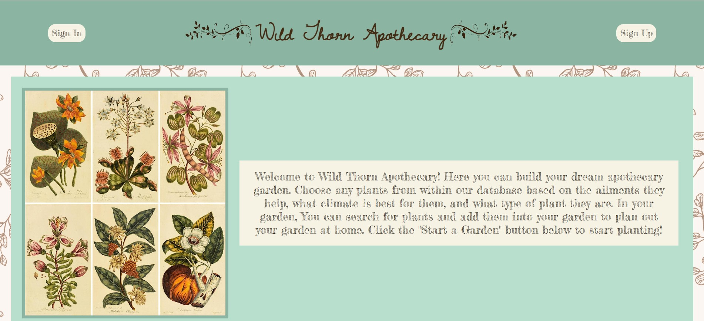
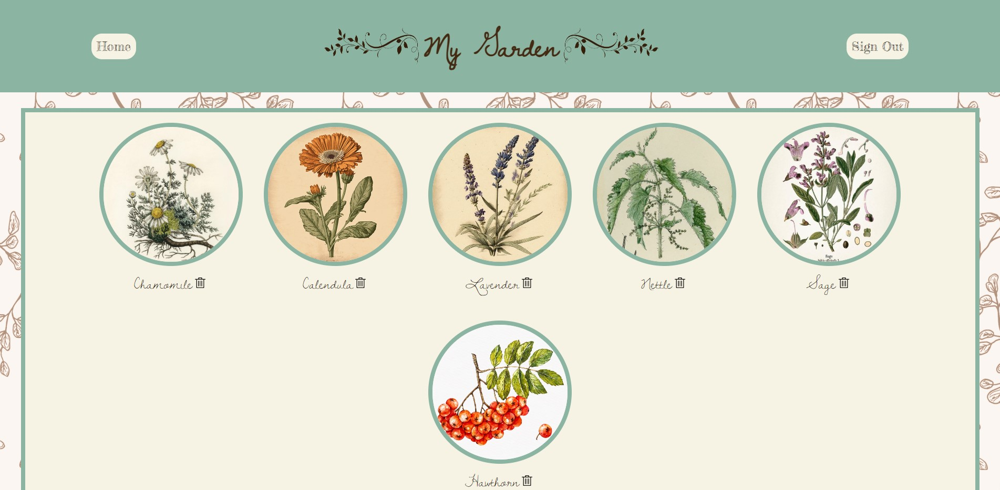
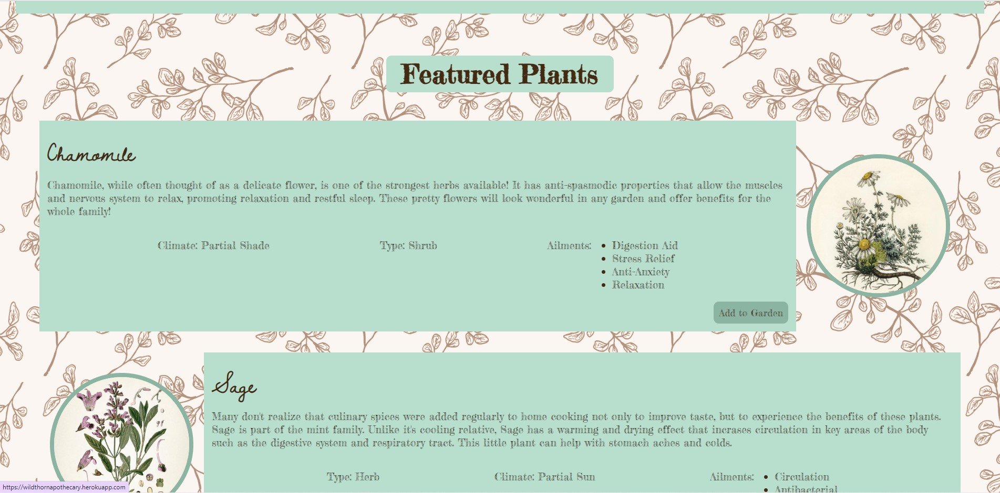

# Wild Thorn Apothecary

## Description
---

Welcome to Wild Thorn Apothecary! We are a small business that believes in the medicinal benefits of plants. Modern medicine has rendered the practice of herbalism nearly forgotten, but we aim to provide the knowledge and tools needed for individuals to start their very own medicinal gardens. Here at Wild Thorn Apothecary, you can browse our database of plants to build your own garden based on what ailments you are trying to treat. We will email you a list of your choices to bring to your local nursery so you know what to buy to get started! Many specialty herbalist shops will charge high prices for specialty tinctures, salves, and teas. We're here to tell you there's a much more cost-efficient and rewarding way - planting them yourself! 

Our website was designed for the University of Washington Coding Bootcamp - Project 2. This project encompasses all of the skills we've learned the past month, including Object-Oriented Programming, Express.js, SQL (MySQL2 and Sequelize), Handlebars, Object-Relational Mapping, and Model-View-Controller. In building this application, we've created the connections between these concepts to make a database powered interactive website. Understanding the full functionality of back-end and front-end programming is extremely valuable to us as students looking to enter the technology work force.

## Table of Contents
---

💾 [Installation](#installation)

💻 [Usage](#usage)

🎥 [Credits](#credits)

📧 [License](#license)

## Installation
---

No installation is necessary! This application has been deployed to Heroku. Please feel free to visit us here: https://wildthornapothecary.herokuapp.com/

## Usage
---

Wild Thorn Apothecary offers a database powered website in which users can add plants to their garden and ultimately start one in real life! On the homepage, you'll be greeted with a welcome message and a prompt to start your garden. If you choose to do so, you will be asked to create an account. Once you've signed in, you'll be brought to your own personalized homepage that shows our featured plants and plants in your garden. To add plants to your garden, click the "My Garden" button and search for the plants you'd like to add. Information such as climate and health benefits will be displayed so you can make informed choices on what you'd like to include. Once you've finished "planting" your garden, click the "Email Me" button. You'll be sent a personalized email with your choices to bring into your local nursery and get started. If you'd like to visit us again, simply log in and continue modifying your garden! As we continue working on this project, more features will be added. Thank you for visiting!

Students and new developers may find it helpful to view our code to see how all the different concepts came together in an interactive website. Code has been commented to explain functionality. Happy coding!

## Credits

### Collaborators

---
 
 - 👀 Ben Laubach (Project Manager)
 - 🐝 Emma Waltho (UI/UX Designer)
 - 🌹 Savannah Miller (Developer)
 - 🐶 Anthony Martindale (Developer)

### Packages

---

**MySQL2**: https://www.npmjs.com/package/mysql2

**Sequelize**: https://www.npmjs.com/package/sequelize
- Connect Session Sequelize

**dotenv**: https://www.npmjs.com/package/dotenv

**bcrypt**: https://www.npmjs.com/package/bcrypt

**Express**: https://www.npmjs.com/package/express
- Express Hanblebars
- Express Session

**Nodemailer**: https://www.npmjs.com/package/nodemailer

### Tools

---

**Figma** (Design): https://www.figma.com/

**Excalidraw** (Wireframes): https://excalidraw.com/

## License

MIT License Copyright (c) 2023 **Wild Thorn Apothecary**